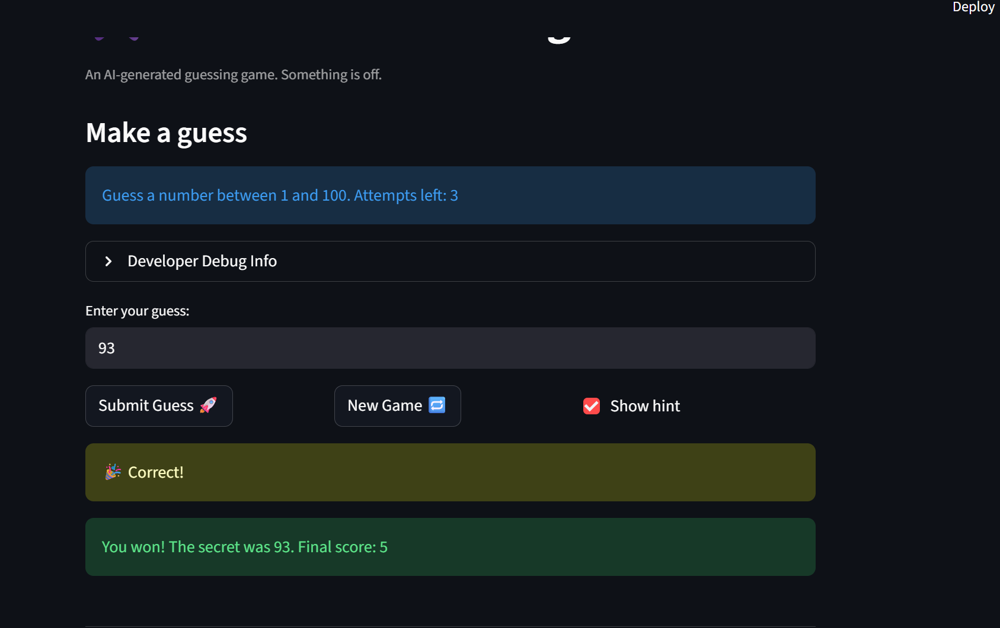

# 🎮 Game Glitch Investigator: The Impossible Guesser

## 🚨 The Situation

You asked an AI to build a simple "Number Guessing Game" using Streamlit.
It wrote the code, ran away, and now the game is unplayable. 

- You can't win.
- The hints lie to you.
- The secret number seems to have commitment issues.

## 🛠️ Setup

1. Install dependencies: `pip install -r requirements.txt`
2. Run the broken app: `python -m streamlit run app.py`

## 🕵️‍♂️ Your Mission

1. **Play the game.** Open the "Developer Debug Info" tab in the app to see the secret number. Try to win.
2. **Find the State Bug.** Why does the secret number change every time you click "Submit"? Ask ChatGPT: *"How do I keep a variable from resetting in Streamlit when I click a button?"*
3. **Fix the Logic.** The hints ("Higher/Lower") are wrong. Fix them.
4. **Refactor & Test.** - Move the logic into `logic_utils.py`.
   - Run `pytest` in your terminal.
   - Keep fixing until all tests pass!

## 📝 Document Your Experience

- [ The game’s purpose is to let the player guess a secret number within a limited number of attempts. It is meant to be a simple and fun way to test logic by using hints like higher or lower. The goal is to guess the correct number before running out of tries.]
- [The first bug is that the game gives the wrong hint by saying “GO LOWER” even when the secret number is actually higher than my guess. The second bug is that it still says “GO LOWER” when you enter 1, even though 1 is already the lowest number you are allowed to guess. The third bug is that the game says you are out of attempts and removes points even though the message right above it says you still have 1 attempt left, and another bug is that after you use all your attempts, it does not let you start a new game. ]
- [One fix was correcting the hint logic so the game says “GO HIGHER” when the secret number is greater than the player’s guess, and “GO LOWER” when the secret number is smaller. Another fix was repairing the attempt counter so the game does not say you are out of attempts while also showing that you still have 1 attempt left. The last fix was making sure the game properly resets after all attempts are used, so a new round can start with fresh attempts, the score updating correctly, and a new secret number. ]

## 📸 Demo

- [ ] [Insert a screenshot of your fixed, winning game here]

## 🚀 Stretch Features

- [ ] [If you choose to complete Challenge 4, insert a screenshot of your Enhanced Game UI here]
